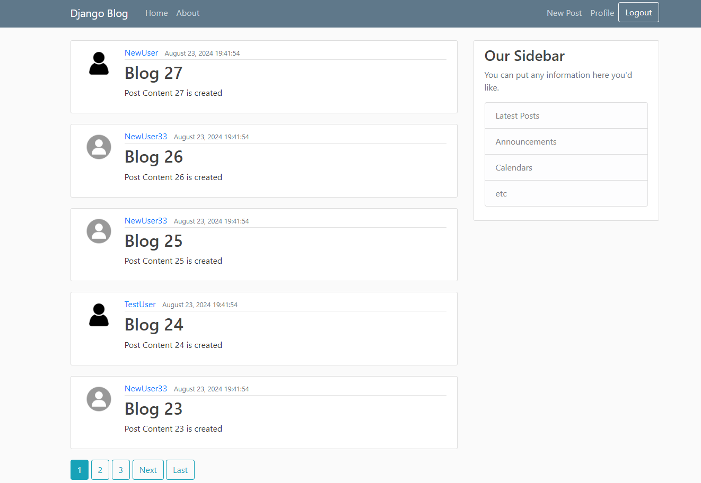
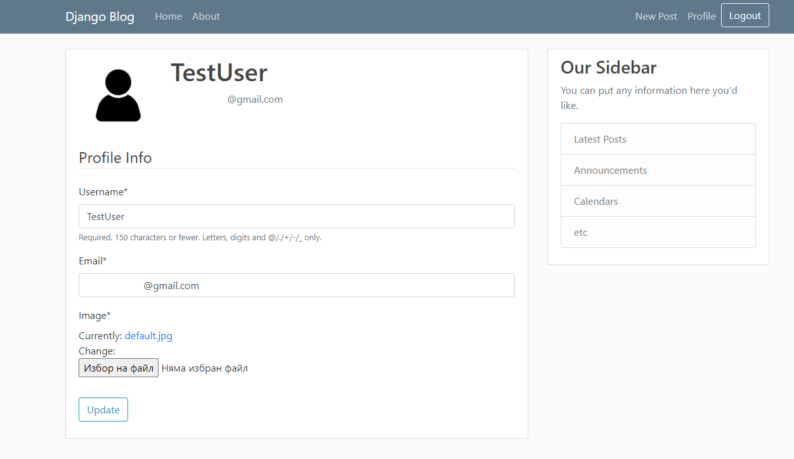
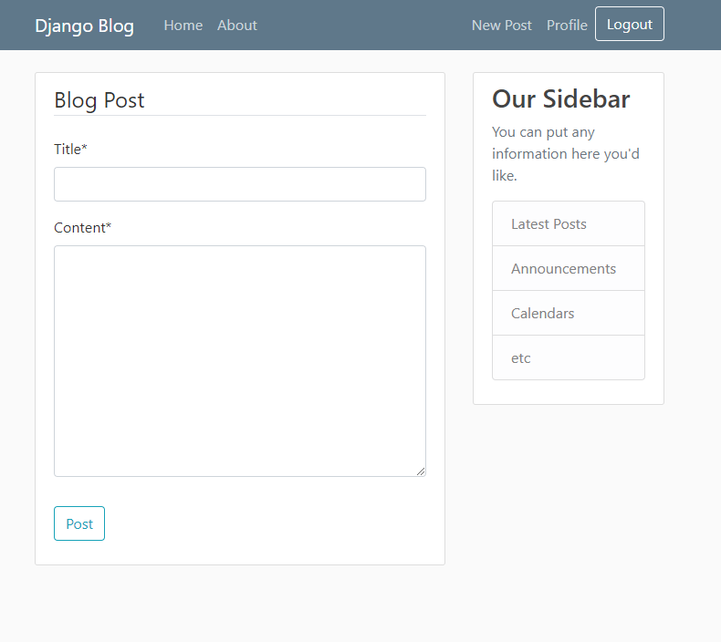

# WebApp Blog with Django
A simple and customizable blog application built with Django. This project allows users to create, read, update, and delete blog posts, as well as manage user profiles and view posts by individual users.
## Features

- User authentication (Sign up, Log in, Log out)
- Create, read, update, and delete blog posts
- View posts by individual users
- User profile management with profile pictures
- Pagination for blog posts
- Email and password reset

## Usage

- **Creating a Post:** After logging in, click on "New Post" in the navigation bar to create a new blog post.
- **Updating a Post:** Navigate to one of your posts and click the "Update" button to edit it.
- **Deleting a Post:** Click the "Delete" button on one of your posts to remove it.
- **Viewing User Posts:** Click on a user's name to view all the posts authored by that user.
- **Managing Your Profile:** Go to the "Profile" section to update your profile information and upload a profile picture.

## Project Structure

- blog/: Contains the main blog application (models, views, templates, forms, and urls).
- users/: Handles user authentication and profile management.
- static/: Contains static files like CSS and images.
- templates/: Contains HTML templates for the project.
- media/: Stores user-uploaded files like profile pictures.
- manage.py: Django's command-line utility for administrative tasks.

## Screenshots

### Home Page

### User Profile

### Creating a Post

